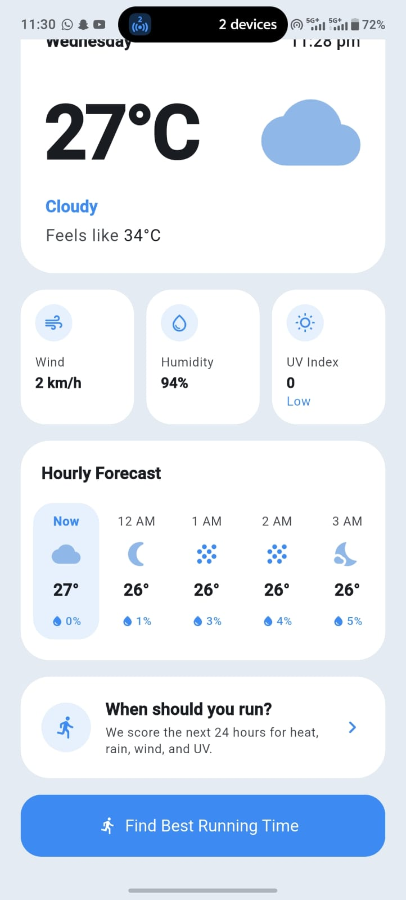
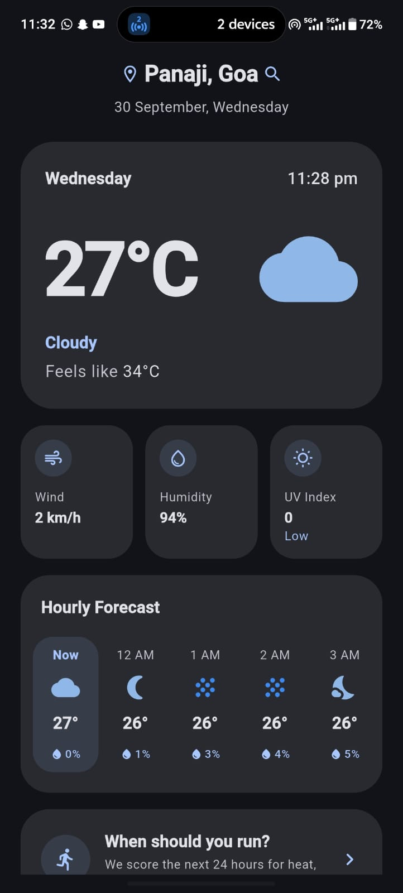
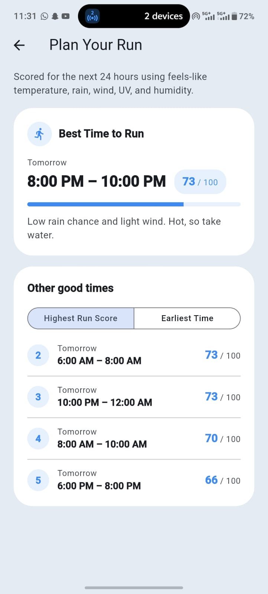
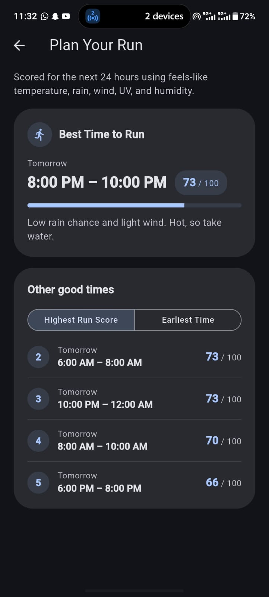
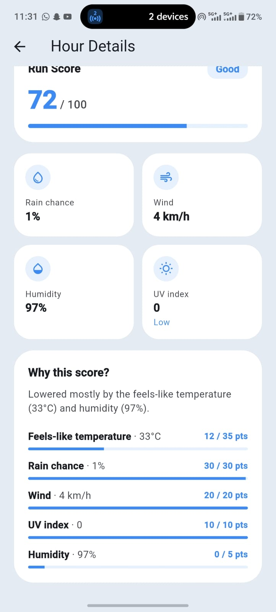
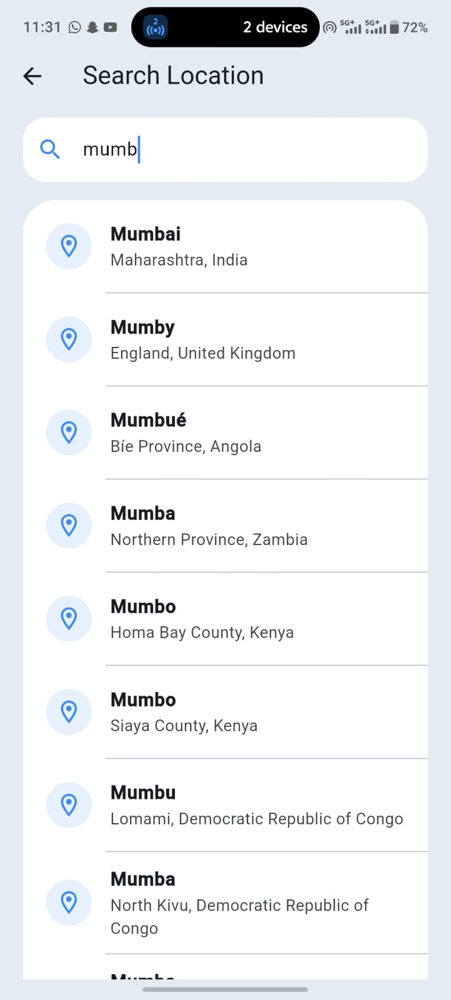

# RunReady 🏃

> **Find the best time to run today.**

RunReady is a Flutter app that turns the live Open-Meteo hourly forecast into a clear answer to one question: **when should I go for a run?**

It gives every hour a **Run Score from 0–100** and recommends the best 2-hour window to run in the next 24 hours. It also explains *why* each hour scored the way it did.

---

## 👤 The user and the problem

**User:** someone who runs outdoors a few times a week, often in a hot, humid, rainy climate (the default location is Panaji, Goa).

**Problem:** deciding when to run means checking temperature, "feels like", rain chance, wind, UV and humidity for every hour, then combining them in your head. Weather apps show the data but don't answer the question.

**What RunReady does in under 30 seconds:**

1. Open the app. The forecast for the selected location loads.
2. Tap **Find Best Running Time**.
3. See the recommended window (e.g. *Tomorrow, 6:00 AM – 8:00 AM · 85 / 100*), a one-line reason, and other good options.

### Why Open-Meteo

- **Free, open, no API key.** There's nothing secret to manage or commit.
- **Hourly data with exactly the variables a runner needs**, including `apparent_temperature` and `uv_index`.
- **A free geocoding API from the same provider**, so location search needs no second service.
- **`timezone=auto`** returns times in the location's local time, which is essential for "run at 6 AM".

---

## 💡 Innovative feature

The core idea is that RunReady **explains its recommendation** instead of just showing a number. Every hour has a **"Why this score?"** breakdown showing how many points each factor earned, e.g. *Rain chance 18 / 30 pts*, and a sentence naming what lowered it most. The best window is chosen only from **realistic running hours**, 5 AM to midnight, in the **location's own time zone**, and alternatives are ranked so they never overlap. A runner can trust the suggestion, understand the trade-off, and pick another slot that suits their day.

---

## ✨ Features

### 🌤️ Live weather forecast
- Current conditions: temperature, feels-like, condition with icon (day/night aware), wind, humidity and UV (with a Low … Extreme label).
- A horizontally scrollable **hourly forecast for the next 24 hours**, starting at "Now". Tap any hour to open **Hour Details**.
- All times are shown in the **selected location's local time**, even if the phone is in a different time zone.

### 📍 Location search
- Search for any city through the Open-Meteo Geocoding API.
- **Debounced:** the request is sent 400 ms after typing stops, and only for queries of **2+ characters**.
- Results show city, region and country; the current location is marked with a check.
- Loading, results, empty ("No places found") and error-with-Retry states.
- Default location: **Panaji, Goa**.

### 🏃 Run Score (the computed insight)
Each hour gets a score from 0–100 built from five factors:

| Factor | Weight | Scores 100 when… | Drops to 0 at… |
|---|---:|---|---|
| Feels-like temperature | 35% | 10–20 °C | −10 °C or 40 °C |
| Rain probability | 30% | 0% | 100% |
| Wind speed | 20% | ≤ 10 km/h | 40 km/h |
| UV index | 10% | ≤ 2 | 10 |
| Humidity | 5% | ≤ 60% | 100% |

Each factor changes linearly between those limits. Then:

```text
Run Score = Temperature × 0.35 + Rain × 0.30 + Wind × 0.20 + UV × 0.10 + Humidity × 0.05
```

Air temperature and weather condition are displayed, but only *feels-like* temperature feeds the score.

On **Hour Details**, the score also gets a rating: **Great** (≥ 80), **Good** (≥ 60), **Fair** (≥ 40), **Poor** (< 40).

### ⏰ Best running window
- Searches the **next 24 hours** for the consecutive **2-hour** window with the highest average score.
- Windows only **start between 5:00 AM and 10:00 PM**, so the latest is 10 PM – 12 AM. Night hours are excluded.
- Hours that have already started are skipped, so a suggestion is never in the past.
- If the best window is after midnight, it is labelled **Tomorrow**.
- A short explanation is generated from the window's weather, e.g. *"Low rain chance and light wind. Hot, so take water."*

**Other good times** shows up to **4 more windows**, each scoring **at least 60**, never overlapping each other or the best window.

**Sort:** **Highest Run Score** (default) or **Earliest Time**. Each window keeps its rank number (#2, #3, …) when sorted by time.

### 📴 Offline fallback
- Every successful forecast is cached on the device **per location** (coordinates + forecast JSON + timestamp) and **survives app restarts**.
- If a later request fails because of the network or API, the cached forecast for **the same location** is shown, with a small **"Last updated 28 Sep, 4:32 PM"** pill. Tapping it retries.
- A **broken/unreadable response is reported as an error**. It never silently falls back to old data and never overwrites a good cache.

### ⚠️ Error handling
Low-level errors (Dio, parsing, …) are mapped to a sealed `AppError` type in the repository. For the weather forecast, the UI shows:

| Error | Message |
|---|---|
| No connection | You're offline. Check your connection and try again. |
| Timeout | The weather request took too long. Try again. |
| Server/API error (e.g. HTTP 5xx) | The weather service is temporarily unavailable. |
| Unreadable data | We couldn't read the weather data. Try again. |
| Anything else | Something went wrong. Please try again. |

Errors appear immediately with a **Retry** button; there are no silent automatic retries. Raw exception text is never shown. Location search currently shows a single generic error message ("Couldn't search right now.") with Retry.

### 🎨 Theme and layout
- **Material 3** with a light and a dark theme from the same blue accent, **following the system setting** (`ThemeMode.system`).
- Colours come from the theme (`colorScheme`, `cardColor`) rather than hard-coded values.
- Responsive: checked from **320 px** wide phones to **landscape**, where content stays in a centred column of at most 480 px.

---

## 🖥️ Screens

| Screen | What it shows |
|---|---|
| **Home** (list) | Location (tap to search), current weather, metrics, scrollable hourly forecast, "When should you run?" prompt, **Find Best Running Time** button, offline "Last updated" pill |
| **Plan Your Run** (insight) | Best 2-hour window, Run Score, explanation, **Other good times** with sorting |
| **Hour Details** (detail) | Date and time, condition, temperature, feels-like, rain, wind, humidity, UV, Run Score + rating, **Why this score?** breakdown |
| **Search Location** (search) | Debounced city search with results, empty and error states |

---

## 📸 Screenshots

| Screen | Light | Dark |
|---|---|---|
| Home |  |  |
| Plan Your Run |  |  |
| Hour Details |  | |
| Search Location |  | |

---

## 🌐 APIs, limits and terms

| API | Endpoint | Used for |
|---|---|---|
| Open-Meteo Forecast | `https://api.open-meteo.com/v1/forecast` | Hourly forecast (`timezone=auto`) |
| Open-Meteo Geocoding | `https://geocoding-api.open-meteo.com/v1/search` | City search → name, region, country, coordinates |

Hourly variables requested: `temperature_2m`, `apparent_temperature`, `precipitation_probability`, `relative_humidity_2m`, `wind_speed_10m`, `uv_index`, `weather_code`.

**No API key is needed**, so there are no secrets in the repository.

**Usage limits:** Open-Meteo's free tier is for **non-commercial use** with a fair-use limit (fewer than 10,000 calls per day). See the [terms](https://open-meteo.com/en/terms). RunReady stays well within it:
- **One** forecast request per location load or Retry. There are no automatic retries or background polling.
- Search is **debounced** (400 ms, 2+ characters), so typing doesn't send a request per keystroke.
- Out-of-date search responses are ignored, and the forecast is cached.

**Attribution:** Weather data by [Open-Meteo.com](https://open-meteo.com/), licensed under [CC BY 4.0](https://creativecommons.org/licenses/by/4.0/).

---

## 🚀 Setup and run

### Versions used

```text
Flutter 3.47.5 • channel stable • revision 6a19cca564 (2026-09-17)
Dart 3.13.4
```

(Output of `flutter --version`. The project needs Dart `^3.13.4`.)

### Run it

```bash
git clone https://github.com/Samarth-Naik07/RunReady.git
cd RunReady
flutter pub get
flutter run                        # Android device or emulator
flutter run -d chrome              # optional: web
```

No API keys or `--dart-define` values are required.

**Windows note:** building with plugins on Windows may ask you to enable **Developer Mode** (symlink support): `start ms-settings:developers`.

### Build the release APK

```bash
flutter build apk --release
# → build/app/outputs/flutter-apk/app-release.apk
```

---

## 🏗️ Architecture

Feature-first folders with clear layers: **UI → state (Riverpod) → repository → API client / cache**. Widgets never call HTTP directly.

```text
lib/
├── core/
│   ├── errors/app_error.dart          # sealed AppError + mapping from Dio/parsing errors
│   ├── network/api_client.dart        # thin Dio client for the forecast API
│   ├── network/geocoding_api_client.dart
│   ├── storage/weather_cache.dart     # shared_preferences cache, one entry per location
│   ├── theme/app_theme.dart           # Material 3 light + dark themes
│   ├── date_format.dart, layout.dart  # small shared helpers
├── features/
│   ├── weather/
│   │   ├── data/          # HourlyForecast/HourlyWeather models, WeatherRepository
│   │   ├── domain/        # current/upcoming hour selection
│   │   ├── providers/     # apiClient, cache, repository, weatherForecastProvider
│   │   └── presentation/  # Hour Details screen, weather icons
│   ├── location/
│   │   ├── data/          # GeoLocation model, LocationRepository
│   │   ├── providers/     # selected location, debounced search notifier
│   │   └── presentation/  # Search Location screen
│   └── run_score/
│       ├── domain/        # RunScoreCalculator, window rules, sorting, explanations
│       ├── providers/     # best window, other windows, sort state
│       └── presentation/  # Plan Your Run screen, Best Time card
└── main.dart              # app setup, theme and Home screen
```

### Data flow

```text
Open-Meteo ─► ApiClient (Dio, timeouts) ─► WeatherRepository ─► weatherForecastProvider ─► UI
                                            │  success → parse → save cache → fresh data
                                            │  network failure → matching cache? → cached data
                                            └─ otherwise → AppError (Network/Timeout/Server/InvalidData/Unknown)
```

- **Selecting a location** updates `selectedLocationProvider`. `weatherForecastProvider` watches it, so the forecast refetches automatically.
- **The Run Score providers** (`bestRunWindowProvider`, `otherRunWindowsProvider`) derive everything from the already-loaded forecast, so opening Plan Your Run or Hour Details makes **no extra API call**.
- **The scoring and window logic** are plain Dart classes and functions in `domain/`, with no Flutter imports, so they're easy to unit-test.

### Modern Dart used
- A **sealed class** `AppError`, mapped with **switch expressions**. The exhaustive switch caught a missing Dio case at compile time.
- **Records**, e.g. `(String, Widget)` for a weather label + icon, and `({int rank, RunWindow window})` for ranked windows.
- **Pattern matching** (`case`, `when`, relational patterns like `>= 51 && <= 57`) for weather-code mapping and UI states.
- **Null safety** throughout; hand-written **immutable models** (`final` fields, `const` constructors, unmodifiable lists).

---

## 📦 Packages and why

| Package | Why it's here |
|---|---|
| `flutter_riverpod` | State management and dependency injection. **Chosen because** providers compose (location → forecast → Run Score), `AsyncValue` gives loading, data and error states for free, and any dependency can be overridden in tests. |
| `dio` | HTTP client with timeouts and typed `DioException`s, which map cleanly to app errors. |
| `shared_preferences` | Stores the offline forecast cache so it survives restarts. A small JSON entry per location doesn't need a database. |
| `cupertino_icons` | Default Flutter template dependency. |
| `flutter_lints` *(dev)* | Lint rules; `flutter analyze` reports **no issues**. |
| `flutter_test` *(dev)* | Unit and widget tests. |

No code generation (models are hand-written) and no UI kits.

---

## 🧪 Testing

```bash
flutter analyze   # No issues found
flutter test      # 106 tests, all passing
```

**106 tests** across 21 files, with **no network calls**. Providers and API clients are replaced with fakes returning known JSON.

| Area | What's covered |
|---|---|
| Models | Forecast and geocoding JSON parsing, missing fields, whole-number values, location-local time |
| Insight logic | Each factor score, weighted Run Score, best window, ranking without overlaps, night-hour filter, sorting, explanations |
| Repository | Cache on success, cache fallback on network failure, per-location cache, errors not hidden by cache, error mapping, cancellation |
| Providers | Retry after failure (success, cached, still failing), upcoming-hours selection, debounce timing |
| Widgets | Home loading → data, offline pill, error + Retry, hourly scrolling (including mouse drag), navigation to Plan Your Run and Hour Details, search flow, sort control, light/dark themes |

If the API is unavailable during development, the tests still run, because they use fixture JSON rather than live data.

---

## ✂️ What I cut, and what I'd do next

**Cut to stay inside the timebox:**
- **Skeleton/shimmer loading.** Loading states currently use Material progress indicators.
- **Mapped error messages for location search.** It uses one generic message with Retry.
- **Tolerating partial API data.** A `null` in the hourly arrays currently shows the "couldn't read the weather data" error rather than skipping that hour.
- **Remembering the selected location** across restarts (the app reopens on Panaji; cached forecasts are kept).
- Pull-to-refresh, favourites and GPS location.

**Next steps:**
1. Skeleton loaders, and mapped errors for search.
2. Skip incomplete hours instead of failing the whole forecast.
3. Persist the selected location (same `shared_preferences` store).
4. Air quality from Open-Meteo's Air Quality API as a Run Score factor. It matters for runners in Indian cities.
5. A GitHub Actions workflow running `flutter analyze` and `flutter test`.
6. Accessibility: large-text (200%) checks and more semantic labels.
7. Split the Home screen widgets out of `main.dart` into `features/weather/presentation/`.

### Known limitations
- Open-Meteo's geocoding lists Panaji as **"Panjim"**, so searching "Panaji" won't find it; "Panjim" will.
- There's no daylight factor; night hours are simply excluded from recommendations.
- The cache keeps one entry per searched location, with no size limit yet.

---

## ⏱️ Time log

| Task | Time |
|---|---:|
| Setup and first screen | 2h |
| Data layer (API client, models, repository) | 4h |
| Riverpod state | 2h |
| Run Score and best window | 2h |
| UI (Home, Plan Your Run, Hour Details, Search) | 4h |
| Location search + debounce | 1h |
| Offline cache | 1h |
| Error mapping + Retry | 3h |
| Theme and responsive fixes | 2h |
| Tests | 5h |
| README, screenshots, recording | 1h |
| **Total** | **27h** |

---

## 🤖 AI usage

**Tool:** Claude Code (Anthropic), used inside VS Code.

**What for:**
- Learning Flutter/Dart concepts step by step (widgets, Riverpod, `AsyncValue`, navigation), with an explanation after each change.
- Implementing features from my step-by-step prompts: the API client, models, repository, Run Score, window ranking, search with debounce, the offline cache, error mapping, the themes.
- Writing and running tests, `flutter analyze` and `dart format`, and fixing what they found.
- Checking layouts by rendering screenshots at 320 px, in landscape and in dark mode.
- Reviewing this README against the assignment brief.

**My role:** I defined the product, the user, the requirements and the order of work. I reviewed each change, asked for explanations, ran the app, and made the product decisions (score weights, running hours, sorting, offline behaviour). I can explain and modify every part of the code: the repository, the providers, the calculator and the error mapping.

---

## 👨‍💻 Author

**Samarth Naik**

Built as a take-home assignment for the **Majhe app — Junior Software Engineer** position.
